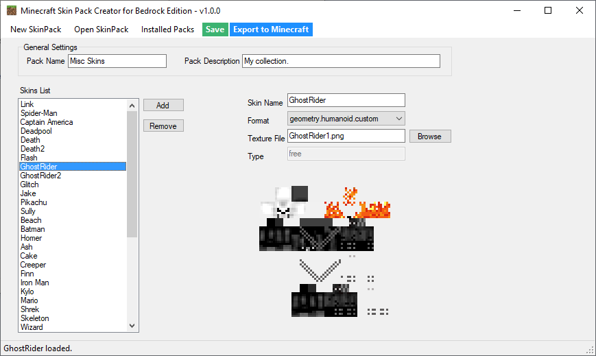
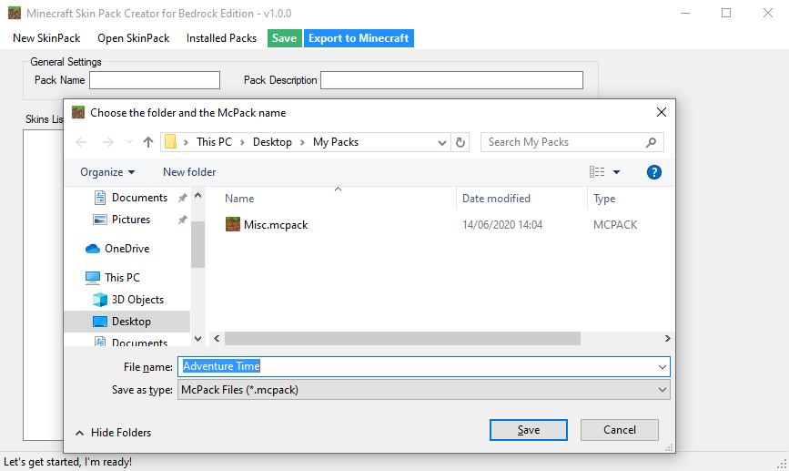
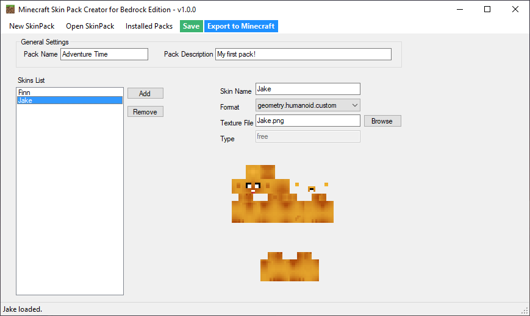
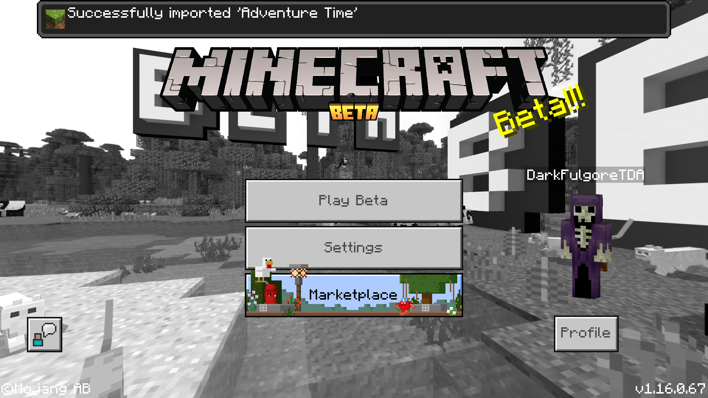
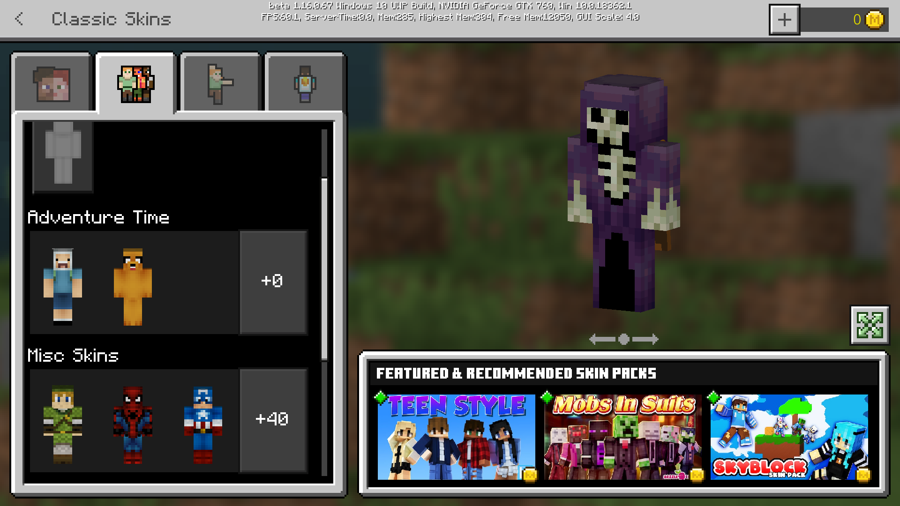

# Minecraft Skin Pack Creator
Skin Pack Creator for the Bedrock Edition (Windows 10) of Minecraft. It will create the .mcpack file so you can install it yourself or export directly to Minecraft.
There's a quick guide below.

## Quick Guide

### Menu overview:

  * **New Skin Pack**: Create a new .mcpack file and you add skins to it. 
  * **Open Skin Pack**: Open an existing .mcpack file, it will automatically fill the list and you can change anything you want. 
  * **Installed Packs**: Open the folder where Minecraft keeps all the installed skin packs. 
  * **Save**: It will create/update the pack you are currently editing. 
  * **Export to Minecraft**: It will save and open Minecraft to automatically import the pack you just made.

### Creating a new Skin Pack
After you downloaded the application from the **Releases** tab. Just run the **MinecraftSkinPackCreator.exe**.

If you are creating a new Skin Pack, just click the **New Skin Pack**, and choose the location and name you want.

Then click **Add** to add a new skin to your pack. It will automatically fill the *Skin Name* and *Forma*' fields, you can change them if you want. The **Type** is default at *free* and is locked for now.
Then click on the button **Browse**, select the skin file you created or downloaded from somewhere.

You can repeat this process and add more skins to your pack.

After adding all the skins you want, you have two options:
* Clicking **Save** will create your pack in the folder you chose before, then you can import it later.
* Clicking **Export to Minecraft** will also save but it will automatically run Minecraft and import your pack.

In this case I clicked **Export to Minecraft**.

And that's it!

### It didn't work?!

You can report bugs and suggest new features. I will try my best to fulfill them!

## Donate

If you enjoyed and the app and want to buy me a cup of coffee, just click the donate button here or on the app. Any amount is more than welcome in this trying times. :)

